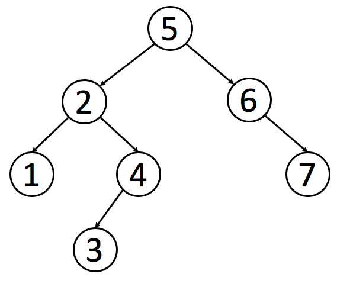
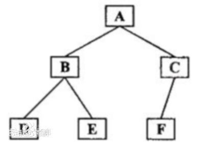

二叉搜索树(Binary Search Tree，简写BST)，又称为二叉排序树或二叉查找树
二叉搜索树（BST）是二叉树的一种特殊表示形式，它满足如下特性：

每个节点中的值必须大于（或等于）存储在其左侧子树中的任何值。
每个节点中的值必须小于（或等于）存储在其右子树中的任何值。
 

下面是一个二叉搜索树的例子：



对于二叉搜索树，我们可以通过中序遍历得到一个递增的有序序列。因此，中序遍历是二叉搜索树中最常用的遍历方法。

中序遍历首先遍历左子树，然后访问根结点，最后遍历右子树。若二叉树为空则结束返回，否则：
（1）中序遍历左子树
（2）访问根结点
（3）中序遍历右子树



验证二叉搜索树

```js
var isValidBST = function(root) {
    // boolean 变量
    let isValidBSTFlag = true;
    // 最大值变量
    let max = -Number.MAX_VALUE;
    const orderSearch = root => {
        if (root) {
            // 中序遍历
            orderSearch(root.left);
            if (root.val > max) {
                max = root.val;
            } else {
                isValidBSTFlag = false;
            }
            orderSearch(root.right);
        }
    }
    orderSearch(root);
    return isValidBSTFlag;
};
```


/**
 * 有序数列转换成二叉树
 * Definition for a binary tree node.
 * function TreeNode(val) {
 *     this.val = val;
 *     this.left = this.right = null;
 * }
 */
/**
 * @param {number[]} nums
 * @return {TreeNode}
 */
var sortedArrayToBST = function(nums) {
  if(nums.length === 0) {
    return null;
  }
  if(nums.length === 1) {
    return new TreeNode(nums[0]);
  }
  var mid = parseInt(nums.length / 2);
  var root = new TreeNode(nums[mid]);
  root.left = sortedArrayToBST(nums.slice(0, mid));
  root.right = sortedArrayToBST(nums.slice(mid+1));
  return root;
};